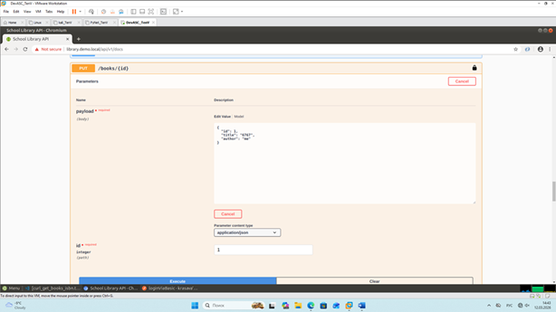
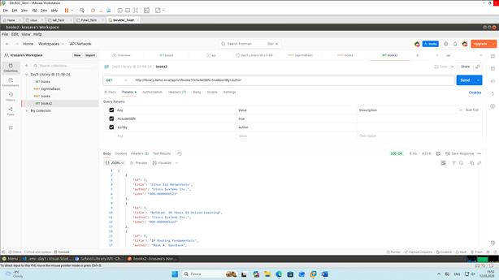
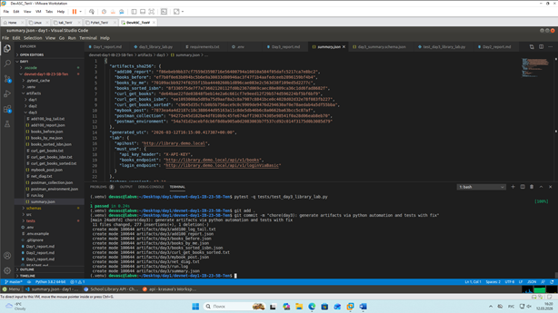

# Day 3 Report — Lab 4.5.5 + Auto-check artifacts

## 1) Student
- Name: Тен Владимир Александрович
- Group: IB-23-5B
- Token: D1-IB-23-5b-24-0A7D
- Repo: https://github.com/kto-to111/devnet-day1-IB-23-5B-Ten

## 2) Lab 4.5.5 completion evidence

### API Docs (Try it out)


### Postman


### Python Script Run


## 3) Artifacts checklist
- artifacts/day3/books_before.json: Yes
- artifacts/day3/books_sorted_isbn.json: Yes
- artifacts/day3/mybook_post.json: Yes
- artifacts/day3/books_by_me.json: Yes
- artifacts/day3/add100_report.json: Yes
- artifacts/day3/postman_collection.json: Yes
- artifacts/day3/postman_environment.json: Yes
- artifacts/day3/curl_get_books.txt: Yes
- artifacts/day3/curl_get_books_isbn.txt: Yes
- artifacts/day3/curl_get_books_sorted.txt: Yes
- artifacts/day3/summary.json: Yes

## 4) Command outputs
### 4.1 Script run
```bash
(.venv) devasc@labvm:~/Desktop/day1/devnet-day1-IB-23-5B-Ten$ python src/day3_library_lab.py --count 100
{
  "schema_version": "3.1",
  "generated_utc": "2026-03-12T16:09:24.142120+00:00",
  "student": {
    "token": "D1-IB-23-5b-24-0A7D",
    "token_hash8": "9307fb77",
    "name": "Тен Владимир Александрович",
    "group": "IB-23-5b"
  },
  "lab": {
    "apihost": "http://library.demo.local",
    "must_use": {
      "login_endpoint": "http://library.demo.local/api/v1/loginViaBasic",
      "books_endpoint": "http://library.demo.local/api/v1/books",
      "api_key_header": "X-API-KEY"
    }
  },
  "artifacts_sha256": {
    "books_before": "ef7b0f0e63b094bc5b6e9a30033d80946ac3f47f1b4aafedceeb2896159bf4b4",
    "books_sorted_isbn": "8f3305f5de7f7a73602120112fd0b2367d069caec80e809ca36c1dd6fad8682f",
    "mybook_post": "7873ea4a4d2187c18c388644d95163a11c8de5db46b6c8a0662ba63bcc5c87af",
    "books_by_me": "70109acbb9274f0255f15ba4440260b1d896cae083e2c563d38f109ed5d2277c",
    "add100_report": "f86ebeb9bb37cf7559d3598716e56400794a10010a584f05dafc5217ca7e8bc2",
    "postman_collection": "94272e45d182be4df810b9c45fe674aff190374305e98541f0a28d06eab8eb70",
    "postman_environment": "54a7d1d2acebfdcb6f8d0a905a0d2083003b7f537cd92c014f3175d0b3085d79",
    "curl_get_books": "de64bae22fde03848fbeb14e2a6c661cf7e9eed12f29b574d596224bf5bf6bf9",
    "curl_get_books_isbn": "ee1093008a5d89a75d9aaf8a2c8a7987c8841bce0c4028d02d32e78f083fb227",
    "curl_get_books_sorted": ""
  },
  "validation": {
    "must_have_mybook_title_contains_token_hash8": true,
    "must_have_added_100": true
  }
}
```
### 4.2 Tests
```bash
(.venv) devasc@labvm:~/Desktop/day1/devnet-day1-IB-23-5B-Ten$ pytest -q tests/test_day3_library_lab.py.                                                                                                                                                                                              [100%]
1 passed in 0.24s
```
## 5) Problems & fixes

- **Problem:**
При попытке загрузки переменных окружения командой `export $(cat .env | xargs)` возникала ошибка `bash: export: 'Владимир': not a valid identifier`. Из-за пробелов в значении `STUDENT_NAME="Тен Владимир Александрович"` Bash воспринимал каждое слово как отдельную (и некорректную) переменную, в результате чего переменная `$STUDENT_NAME` содержала только фамилию "Тен".

- **Fix:**
1. Отредактировал файл `.env`, обернув полное имя в двойные кавычки: `STUDENT_NAME="Тен Владимир Александрович"`.
2. Заменил команду экспорта на более надежный способ: `set -a; source .env; set +a`, который корректно обрабатывает значения с пробелами внутри кавычек.

- **Proof:**
После фикса команда `echo $STUDENT_NAME` выводит полное ФИО:
```text
Тен Владимир Александрович
```