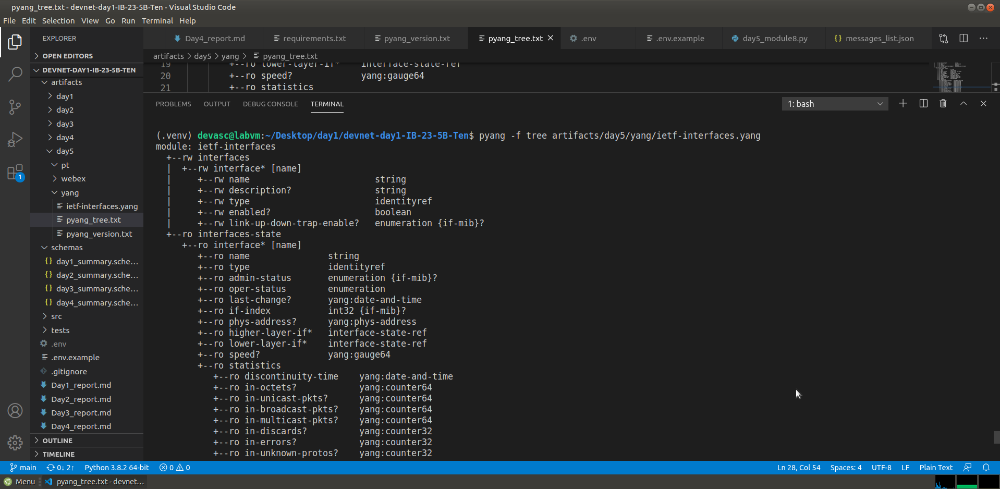

# Day 5 Report — Module 8 Capstone

## 1) Student
- Name: Тен Владимир Александрович
- Group: IB-23-5B
- Token: D1-IB-23-5b-24-0A7D
- Repo: https://github.com/kto-to111/devnet-day1-IB-23-5B-Ten


## 2) YANG (8.3.5)
- Evidence files:
  - artifacts/day5/yang/ietf-interfaces.yang
  - artifacts/day5/yang/pyang_version.txt
  - artifacts/day5/yang/pyang_tree.txt
- Screenshot (optional): pyang tree output



## 3) Webex (8.6.7)
- Room title contains token_hash8: Yes
- Message text contains token_hash8: Yes
- Evidence files:
  - me.json / rooms_list.json / room_create.json / message_post.json / messages_list.json

## 4) Packet Tracer Controller REST (8.8.3)
- external_access_check contains “empty ticket”: Yes
- serviceTicket saved: Yes
- Evidence files:
  - external_access_check.json / network_devices.json / hosts.json
  - postman_collection.json / postman_environment.json
  - pt_internal_output.txt

## 5) Commands output (paste exact)
```bash
(.venv) devasc@labvm:~/Desktop/day1/devnet-day1-IB-23-5B-Ten$ python3 src/day5_summary_builder.py 
{
  "schema_version": "5.0",
  "generated_utc": "2026-03-13T13:30:16.055738+00:00",
  "student": {
    "token": "D1-IB-23-5b-24-0A7D",
    "token_hash8": "9307fb77",
    "name": "Тен Владимир Александрович",
    "group": "IB-23-5b"
  },
  "checks": {
    "pyang_tree_ok": true,
    "webex_room_ok": true,
    "webex_message_ok": true,
    "pt_empty_ticket": true,
    "pt_version_ok": true
  },
  "evidence_sha256": {
    "ietf_interfaces": "9a7aee5b007de501cbdbc6fc0139dd04b795695208f9d8c6e0fc0ffbad5184db",
    "pyang_version": "8b5e7c88ce3fc49181f1a43dbe095a9ef39eafbe4f182f8d3fa42addd49150f2",
    "pyang_tree": "a3bb1707b78305942ef365981d0d6ed1d3bc3ef08988112ff2739461610c587b",
    "webex_me": "82e9b2740c7a6e6e985f848b2334f3d459f275d7ccb80552709927b48432d288",
    "webex_rooms_list": "285691534398a58b03cb0eb78c7ed37dc99a5eddddb4dc24794c32f436eb05e1",
    "webex_room_create": "2707f3b502f78b3a806eb08cd6b3d174c5fcae31e15865c2f6768ae9e09ae418",
    "webex_message_post": "210fcca206adb78f21cbbe624892601c1c4ab03a60626985d313e590249c24d0",
    "webex_messages_list": "a643730e48f5f9df610c4c911af19b2607a9dee7f75e6eeb99ab462e982ed400",
    "pt_ext_access": "87b7bcf6bf8bbbe4276f908341b67c30b8255c88aa9481316f786a473d312176",
    "pt_service_ticket": "99e2bb5179e3eb92dab265006a0f9fe191838442fb3ea31a08239d55f9c0dd7c",
    "pt_network_devices": "d680717157f4f88c0d02c1e1927815295278e1cc98e4583dc8447a93050b8d32",
    "pt_hosts": "91ef3574750ba1aff13285e91803aed9d60636fff0150bd8ba7ff4787dac4d22",
    "pt_internal_output": "008cc6953c397ae2b0bcf64b367080c4db9c93cded28bc158f1303603255273b",
    "pt_postman_collection": "e6fff163a92e01929cd3e0f3750cd262e5e91c8371211f3f1dc48bc39892611a",
    "pt_postman_environment": "816a8d54b285727127ebc0855d361d778d9b7ac34d8031a133de162e29c1330e"
  },
  "validation_passed": true,
  "run": {
    "python": "3.8.2",
    "platform": "linux"
  }
}
```

```bash
(.venv) devasc@labvm:~/Desktop/day1/devnet-day1-IB-23-5B-Ten$ pytest tests/test_day5_module8.py -q
.                                                                                                                                                       [100%]
1 passed in 0.11s
```
## 6) Problems & fixes
### Problem: 
Внутри Packet Tracer на Admin PC не запускалась вкладка Programming, что сделало невозможным выполнение Python-скриптов непосредственно внутри эмулятора.

### Fix: 
Для получения данных от контроллера (Part 6) скрипты были запущены через VS Code с использованием функции External Access (порт 58000). Запросы перенаправлены на localhost, что позволило получить идентичные данные о хостах и устройствах.

### Proof: 
Файл pt_internal_output.txt содержит корректные данные о топологии, подтверждающие успешное взаимодействие с API контроллера..